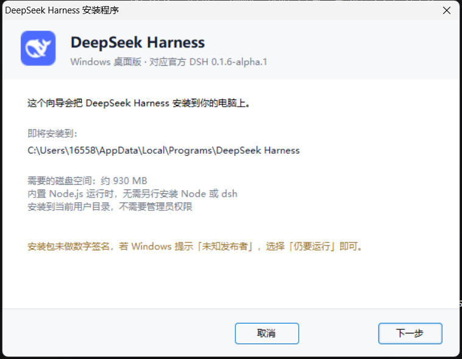
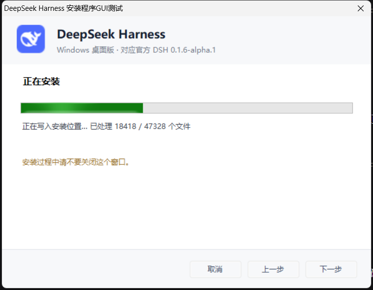

# DSH Desktop（Electron 构建）

把 **DeepSeek Harness (DSH)** 打包成 Windows 桌面应用的可复现构建方案。

> **这不是官方项目。** DSH 官方只发布源码（`apps/desktop`），不提供预编译安装包。
> 本仓库是一套第三方构建脚本 + 自解压安装器，产物为 `DSH-Setup.exe`。

---

## 它解决什么问题

官方 `apps/desktop` 是 Electron 壳 + 一个私有 Host 进程，但直接 `pnpm run dev:desktop`
要求先构建整个 monorepo（几千个包 + 境外工具链）。本方案只取需要的两个 app，
复用本机已安装的 `@deepseek-ai/dsh` 依赖树，在 Windows 上跑通并打出**可双击安装的 exe**。

主要难点都已脚本化（见 `docs/踩坑记录.md`）：

| 问题 | 处理 |
|---|---|
| 官方 `import { app } from 'electron'` 在 ESM 下必抛错 | `postbuild.mjs` 改写为 `createRequire` |
| 打包态用 Electron 当 Runtime 会被 addon 指纹校验拒绝 | `postbuild.mjs` 改用内置 Node |
| `process.resourcesPath` 层级不可靠 | 统一改走 `app.getAppPath()` |
| NSIS 工具链要下境外资源（国内基本不通） | 自写 C# 自解压安装器 |
| .NET 处理不了 260+ 字符路径 | 解压交给 `tar.exe`、复制交给 `robocopy` |
| `@deepseek-ai/dsh-home-paths` 是 workspace 依赖，打包时丢失 | `afterpack.mjs` 手工补齐 |
| 运行时依赖在嵌套位置，顶层找不到 | `materialize-runtime.mjs` 扁平化提升 |

---

## 直接下载（不想自己构建）

| 版本 | 安装包 | 大小 |
|---|---|---|
| [v0.1.6-alpha.2](https://github.com/HsgtLgt/dsh-desktop/releases/tag/v0.1.6-alpha.2) | [DSH-Setup.exe](https://github.com/HsgtLgt/dsh-desktop/releases/download/v0.1.6-alpha.2/DSH-Setup.exe) | 392.6 MB |
| [v0.1.6-alpha.1](https://github.com/HsgtLgt/dsh-desktop/releases/tag/v0.1.6-alpha.1) | [DSH-Setup.exe](https://github.com/HsgtLgt/dsh-desktop/releases/download/v0.1.6-alpha.1/DSH-Setup.exe) | 332 MB |

对应官方 DSH `0.1.6-alpha.2`。**无需预装 Node.js 或 dsh**，运行时已内置。

> alpha.2 的运行时比 alpha.1 大不少：官方把 LibreOffice（`libreoffice-kit-win32-x64`，约 325 MB）
> 纳入了依赖闭包，用于 Office → PDF 技能。安装后约 1.1 GB。

> 安装包未做数字签名，SmartScreen 会提示「未知发布者」，选择「仍要运行」即可。
> 校验值见 Release 说明页。

---

## 环境要求

- **Windows 10/11 x64**
- **Node.js** ≥ 22（用于跑脚本）
- **pnpm**（`npm i -g pnpm`）
- **7-Zip**（`C:\Program Files\7-Zip\7z.exe`，或用 `SEVEN_ZIP` 指定）
- **.NET Framework 4.x**（编译安装器，Windows 自带）
- 本机已安装 **`@deepseek-ai/dsh`**（`npm i -g @deepseek-ai/dsh@0.1.6-alpha.2`）——运行时依赖树从它复制；
  版本必须与 `DSH_VERSION` 一致，也可以用 `DSH_INSTALL_DIR` 指向别处的安装
  （例如 `npm i --prefix .build-tmp/npm-prefix @deepseek-ai/dsh@0.1.6-alpha.2`）
- 网络：能访问 GitHub 与 npm 镜像

## 快速开始

```powershell
# 1) 拉取官方源码 + 装配适配文件 + 安装工具链（首次约 5-10 分钟）
node scripts/bootstrap.mjs

# 2) 编译 Electron 壳与 desktop-host
node scripts/build-shell.mjs

# 3) 准备随包分发的运行时（下载 Node 官方包并校验 SHA256；复制 pnpm）
node scripts/prepare-node.mjs

# 4) 物化 dsh 运行时树（复制 + 扁平化依赖；版本必须与 DSH_VERSION 一致）
#    没装全局 dsh 时，先装一份到独立 prefix 再指过去：
#    npm i --prefix .build-tmp/npm-prefix @deepseek-ai/dsh@0.1.6-alpha.2
#    $env:DSH_INSTALL_DIR = "$PWD\.build-tmp\npm-prefix\node_modules\@deepseek-ai\dsh"
node scripts/materialize-runtime.mjs

# 5) 生成运行时完整性清单 desktop-runtime.json
node --experimental-strip-types scripts/gen-runtime-descriptor.mjs

# 6) 打包未打包应用（electron-builder --dir）
node scripts/package-app.mjs

# 7) 生成安装包载荷
node scripts/make-payload.mjs

# 8) 编译安装器并合成 DSH-Setup.exe
node scripts/build-installer.mjs
```

产物：`dsh-desktop-src/apps/desktop/.desktop-build/targets/win-x64/artifacts/DSH-Setup.exe`（约 393 MB）

指定版本：`$env:DSH_VERSION='0.1.6-alpha.2'`（默认即此值）。版本号只有 `scripts/vars.mjs` 一处出处，
安装器的副标题与注册表 `DisplayVersion` 由构建时占位符替换，不需要手工同步。

## 开发态运行（不打包）

```powershell
node scripts/build-shell.mjs
node scripts/dev-start.mjs          # 直接启动
node scripts/dev-start.mjs --check  # 启动并校验界面是否加载出来
```

## 安装包行为

双击 `DSH-Setup.exe` 进入**图形化安装向导**（WinForms，无控制台窗口）：

| 步骤 | 内容 |
|---|---|
| 1. 欢迎 | 显示安装位置与所需磁盘空间 |
| 2. 选择安装位置 | 默认 `%LOCALAPPDATA%\Programs\DeepSeek Harness`，可更改；路径偏长时给出提示 |
| 3. 安装选项 | 是否创建桌面快捷方式 / 开始菜单项 |
| 4. 安装中 | 实时进度条 + 「已处理 N / 27822 个文件」计数 |
| 5. 完成 | 可勾选立即启动，失败时在同一页显示原因 |




安装过程约 2-4 分钟（解压约 1.1 GB 后复制到位）。安装完成后注册到「应用和功能」。
若检测到应用正在运行，向导会询问并自动关闭它（覆盖安装/升级必需）。

卸载：运行安装目录下的 `uninstall.cmd`，或从「应用和功能」卸载。

## 目录结构

```
.
├── scripts/                  构建脚本（全部可移植，无硬编码路径）
│   ├── vars.mjs              统一路径推导
│   ├── bootstrap.mjs         拉官方源码 + 装配 + 装依赖
│   ├── build-shell.mjs       编译壳与 Host
│   ├── postbuild.mjs         tsc 后的必要修补（见上文表格）
│   ├── bundle-preload.mjs    打包三个 preload + renderer 资源
│   ├── sync-shell-deps.mjs   从 dsh 依赖树补齐 workspace 依赖
│   ├── version-token.mjs     安装器版本占位符替换
│   ├── prepare-node.mjs      内置 Node + pnpm
│   ├── materialize-runtime.mjs  物化 dsh 运行时树
│   ├── gen-runtime-descriptor.mjs  生成完整性清单
│   ├── package-app.mjs       electron-builder --dir
│   ├── make-payload.mjs      生成 payload.zip
│   ├── build-installer.mjs   编译安装器并合成 exe
│   ├── dev-start.mjs         开发态启动
│   ├── afterpack.mjs         electron-builder 钩子
│   └── tools/                窗口检查等诊断脚本
├── installer/                安装器源码
│   ├── Setup.cs              C# 自解压宿主 + WinForms 图形化向导（约 850 行）
│   ├── install.ps1           无界面安装逻辑（无人值守场景可用）
│   ├── uninstall.cmd         卸载
│   ├── manifest.xml          长路径感知 + UTF-8 代码页
│   └── builder.yml           electron-builder 配置模板
├── patch/                    注入官方源码的适配文件
├── icon/                     图标（DeepSeek 鲸鱼 + 生成脚本）
└── docs/                     说明与踩坑记录
```

`dsh-desktop-src/`（构建工作树）由 `bootstrap.mjs` 生成，**不入库**。

## 已知限制

- **未做数字签名**：Windows 可能提示「未知发布者」，选「仍要运行」
- **只支持 win-x64**：脚本里的目标路径写死了 win-x64（改 `vars.mjs` 可扩展）
- **自动更新不可用**：没有签名更新源
- **依赖本机已装的 dsh**：运行时依赖树从本机（或 `DSH_INSTALL_DIR`）复制，
  版本必须与 `DSH_VERSION` 一致（默认 `0.1.6-alpha.2`），否则 `materialize-runtime.mjs` 直接报错
- **安装包 392.6 MB**：alpha.2 的运行时含 LibreOffice（Office → PDF 技能）与内置 Node，安装后约 1.11 GB
- 官方 NSIS 打包链路在本方案中**未打通**（工具链下载受阻），故改用自解压 exe（带 WinForms 向导）

## 版本记录

| 版本 | 官方 DSH | 壳 | 内置 Node | 说明 |
|---|---|---|---|---|
| v0.1.6-alpha.2 | `dsh-v0.1.6-alpha.2` | Electron 44.4.1 | 24.17.0 | Host 依赖闭包换新，运行时含 LibreOffice |
| v0.1.6-alpha.1 | `dsh-v0.1.6-alpha.1` | Electron 44.3.0 | 24.17.0 | 首个 Electron 方案版本，图形化安装向导 |

## 与旧版的关系

本仓库此前是一个 Tauri 实现（v0.1.0 ~ v0.2.4，见 git 历史与 Releases）。
当前分支已替换为 Electron 方案。旧版源码仍可通过历史提交与 tag 找回：

```powershell
git checkout v0.2.4        # 回到 Tauri 版
```

## 许可

本仓库脚本与安装器：MIT（见 `LICENSE`）。
第三方组件与其许可：见 `NOTICE.md`。

> DeepSeek 名称与鲸鱼标识属于 DeepSeek。本仓库为社区构建，**非官方发布**。
